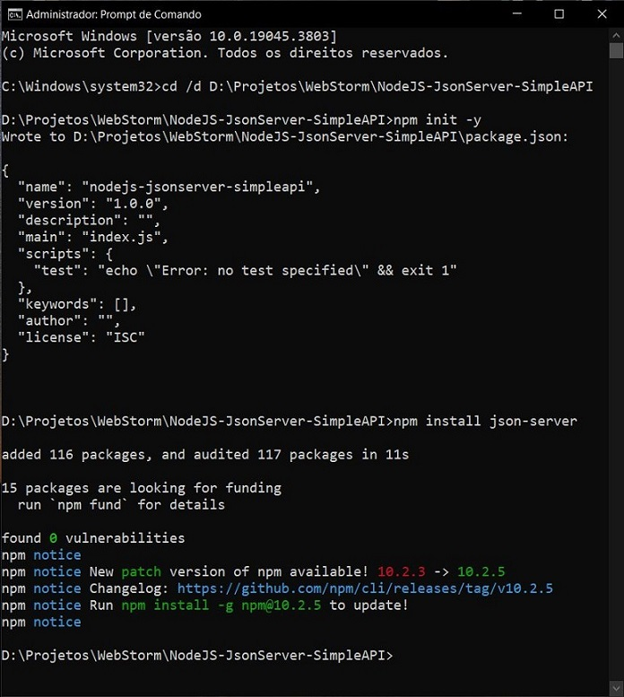

# NodeJS - JsonServer - SimpleAPI
API simples em JSON com JSON Server e NodeJS.

Os passos do desenvolvimento do projeto foram:

1. Abrir o terminal no diretório desejado: `cd /d D:\Projetos\WebStorm\NodeJS-JsonServer-SimpleAPI`;
2. Inicializar o projeto Node.js com um arquivo package.json: `npm init -y` ou `npm init`;
3. Instalar o JSON Server no projeto: `npm install json-server`; 

4. Criar diretório `data/` e arquivo `db.json` dentro dele;
5. Inserir os dados em `db.json`;
6. Em `package.json`, adicionar a chave-valor `"api" : "json-server --watch data/db.json"` em `"scripts"`;
7. Iniciar o servidor: `npm run api`.

