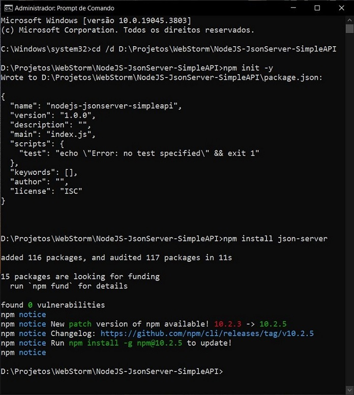
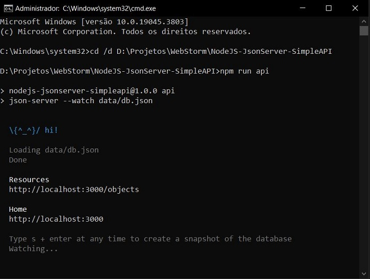

# NodeJS - JsonServer - SimpleAPI
Simple JSON API with JSON Server and NodeJS.

The project development steps were:

1. Open the terminal in the desired directory: `cd /d D:\Projetos\WebStorm\NodeJS-JsonServer-SimpleAPI`;
2. Initialize the Node.js project with a package.json file: `npm init -y` or `npm init`;
3. Install JSON Server in the project: `npm install json-server`;

4. Create `data/` directory and `db.json` file inside it;
5. Insert the data into `db.json`;
6. In `package.json`, add the key-value `"api" : "json-server --watch data/db.json"` in `"scripts"`;
7. Start the server: `npm run api`.

